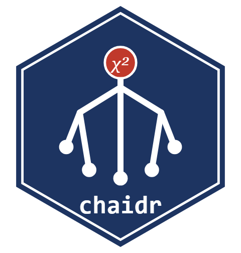
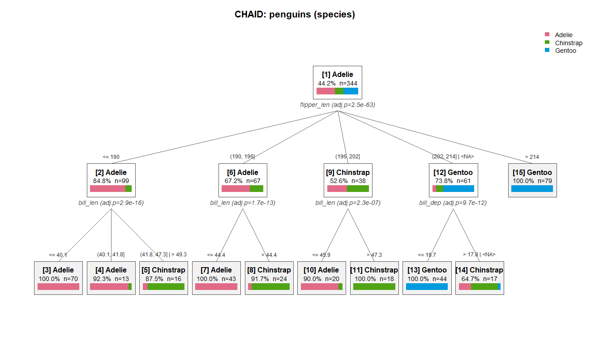

<!-- 本ファイルは README.md（英語版）の日本語訳。内容を変更する場合は README.Rmd を編集して knit した後、本ファイルにも反映すること -->

# chaidr 

<!-- badges: start -->

<!-- badges: end -->

chaidr は、CHAID（Chi-squared Automatic Interaction Detection）および
Exhaustive CHAID 決定木アルゴリズムの base R 実装です。IBM SPSS Statistics
Algorithms ドキュメントの仕様（Kass 1980; Biggs, de Ville, and Suen 1991）に
準拠しています。学習・予測のコアは base R のみで動作し、可視化バックエンドと
'partykit' 連携はオプションのソフト依存です。

English version:
[README.md](https://github.com/morimotoosamu/chaidr/blob/HEAD/README.md)

## 特徴

- 多岐分割による標準 **CHAID** と **Exhaustive CHAID** の木構築。
- 予測変数: 名義、順序（欠損値の *floating* カテゴリ対応）、連続
  （分位ビンへ自動離散化）。
- 目的変数: 名義（Pearson カイ二乗検定）、順序（Goodman row-effects
  モデル）、連続（一元配置 ANOVA F 検定）。
- `freq` による頻度重み。集計済みデータでも個票と同じ結果を再現。
- `predict()` によるクラス・クラス確率・所属ノードの予測。
- モデル検査: ノード表（`chaid_table()`）、決定ルール
  （`chaid_rules()`）、予測変数重要度（`chaid_importance()`）。
- 評価: ゲイン・リフト分析（`chaid_gains()`）とホールドアウトデータでの
  検証（`chaid_validate()`）。
- 可視化: base graphics の `plot()`、'Graphviz' DOT 出力
  （`chaid_dot()`、`chaid_graphviz()`）、'plotly' による対話的な木
  （`chaid_plotly()`）、'partykit' オブジェクトへの変換
  （`chaid_as_party()`）。

## CHAID の使い道

予測精度だけが目的なら、'XGBoost' や 'LightGBM' といった現代の勾配
ブースティング系の手法のほうが一般に高性能です。CHAID の強みは別の
ところにあります — **分析結果の解釈性、意思決定への直結、そしてすべての
分岐に統計的根拠があること**です。CHAID はブラックボックスではなく、
各分岐が有意性検定に裏付けられた単一の多分岐木を構築します。コンサル
ティングやマーケティングの現場で、CHAID が今なお非常に強力な選択肢で
あり続けている理由がここにあります。

典型的な用途:

- アンケート分析・顧客満足度（CS）調査・市場調査
- マーケティングのセグメンテーション（ターゲット選定）
- 説明責任（Accountability）が強く求められる領域
- 探索的データ分析（EDA）の初期段階

## インストール

CRAN 公開後はリリース版をインストールできます。

``` r
install.packages("chaidr")
```

それまでは、[GitHub](https://github.com/morimotoosamu/chaidr) から開発版を
インストールできます。

``` r
# install.packages("remotes")
remotes::install_github("morimotoosamu/chaidr")
```

## クイックスタート

`penguins` データセット（R \>= 4.5 に同梱）は連続予測変数と欠損値を
含んでおり、どちらも CHAID がそのまま扱えます。

``` r
library(chaidr)

data(penguins)
fit <- chaid(species ~ ., data = penguins,
             control = chaid_control(min_parent = 30, min_child = 10))
print(fit)
#> CHAID decision tree (method = "chaid")
#> Response: species (categorical) 
#> Valid cases: 344 (data: 344 rows) 
#> 
#> [1] root: Adelie (44.2%), n=344 | split: flipper_len (adj.p=2.48e-63, chi2=328.5, B=714)
#>   [2] flipper_len in {<= 190}: Adelie (84.8%), n=99 | split: bill_len (adj.p=2.92e-16, chi2=78.21, B=28)
#>     [3] bill_len in {<= 40.1}: Adelie (100.0%), n=70 *
#>     [4] bill_len in {(40.1, 41.8]}: Adelie (92.3%), n=13 *
#>     [5] bill_len in {(41.8, 47.3] | > 49.3}: Chinstrap (87.5%), n=16 *
#>   [6] flipper_len in {(190, 196]}: Adelie (67.2%), n=67 | split: bill_len (adj.p=1.66e-13, chi2=58.69, B=9)
#>     [7] bill_len in {<= 44.4}: Adelie (100.0%), n=43 *
#>     [8] bill_len in {> 44.4}: Chinstrap (91.7%), n=24 *
#>   [9] flipper_len in {(196, 202]}: Chinstrap (52.6%), n=38 | split: bill_len (adj.p=2.31e-07, chi2=30.78, B=8)
#>     [10] bill_len in {<= 45.9}: Adelie (90.0%), n=20 *
#>     [11] bill_len in {> 47.3}: Chinstrap (100.0%), n=18 *
#>   [12] flipper_len in {(202, 214] | <NA>}: Gentoo (73.8%), n=61 | split: bill_dep (adj.p=9.69e-12, chi2=56.14, B=15)
#>     [13] bill_dep in {<= 16.7}: Gentoo (100.0%), n=44 *
#>     [14] bill_dep in {> 17.8 | <NA>}: Chinstrap (64.7%), n=17 *
#>   [15] flipper_len in {> 214}: Gentoo (100.0%), n=79 *
```

`flipper_len` のような連続予測変数は、木構築の前に分位ビンへ離散化され、
統計的に類似したビン同士が再統合されて多岐分割になります。`<NA>` を含む
グループは、欠損値が floating カテゴリとして統合された先を示します。
末端ノードには `*` が付きます。

同じ木は base graphics でプロットできます（ノード内の帯は各ノードの
クラス分布）。

``` r
plot(fit, main = "CHAID: penguins (species)")
```



予測は標準の S3 `predict()` インターフェースで行います。

``` r
pred <- predict(fit, penguins)          # クラスラベル（factor）
mean(pred == penguins$species)          # 訓練データ精度
#> [1] 0.9622093

round(predict(fit, head(penguins, 3), type = "prob"), 3)
#>      Adelie Chinstrap Gentoo
#> [1,]      1         0      0
#> [2,]      1         0      0
#> [3,]      1         0      0
```

全末端ノードの決定ルール:

``` r
chaid_rules(fit)
#>    node
#> 1     3
#> 2     4
#> 3     5
#> 4     7
#> 5     8
#> 6    10
#> 7    11
#> 8    13
#> 9    14
#> 10   15
#>                                                                                                  rule
#> 1                                                             bill_len <= 40.1 and flipper_len <= 190
#> 2                                                     bill_len in (40.1, 41.8] and flipper_len <= 190
#> 3                                (bill_len in (41.8, 47.3] or bill_len > 49.3) and flipper_len <= 190
#> 4                                                      bill_len <= 44.4 and flipper_len in (190, 196]
#> 5                                                       bill_len > 44.4 and flipper_len in (190, 196]
#> 6                                                      bill_len <= 45.9 and flipper_len in (196, 202]
#> 7                                                       bill_len > 47.3 and flipper_len in (196, 202]
#> 8                          bill_dep <= 16.7 and (flipper_len in (202, 214] or flipper_len is missing)
#> 9  (bill_dep > 17.8 or bill_dep is missing) and (flipper_len in (202, 214] or flipper_len is missing)
#> 10                                                                                  flipper_len > 214
```

## 主要関数

| タスク | 関数 |
|----|----|
| モデル学習 | `chaid()`、`chaid_control()` |
| 予測 | `predict()` |
| 検査 | `print()`、`summary()`、`chaid_table()`、`chaid_rules()`、`chaid_importance()` |
| 評価 | `chaid_gains()`、`chaid_validate()` |
| 可視化 | `plot()`、`chaid_dot()`、`chaid_graphviz()`、`chaid_plotly()` |
| partykit 連携 | `chaid_as_party()` |

## ドキュメント

- `vignette("chaidr")` – 英語の入門編。
- `vignette("chaidr-ja")` – アルゴリズム・全オプション設定・評価・
  可視化を網羅した詳細チュートリアル（日本語）。

## 参考文献

- Kass, G. V. (1980). An exploratory technique for investigating large
  quantities of categorical data. *Applied Statistics*, 29(2), 119–127.
- Biggs, D., de Ville, B., & Suen, E. (1991). A method of choosing
  multiway partitions for classification and decision trees. *Journal of
  Applied Statistics*, 18(1), 49–62.
- IBM Corp. *IBM SPSS Statistics Algorithms* – “CHAID and Exhaustive
  CHAID Algorithms”.

## 謝辞

本パッケージの開発にあたっては Google Gemini と Claude Code（Anthropic）
の支援を受けました。

## ライセンス

MIT (c) Osamu Morimoto
