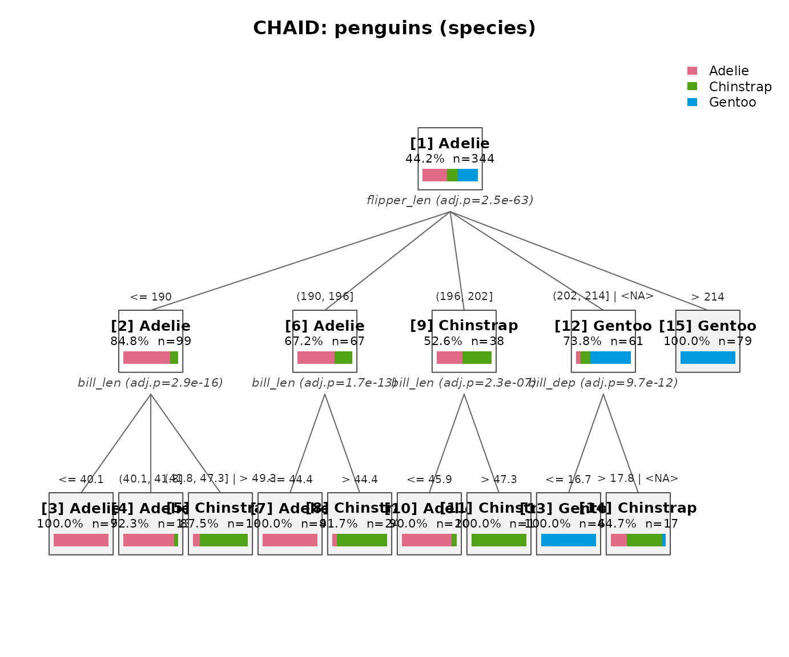
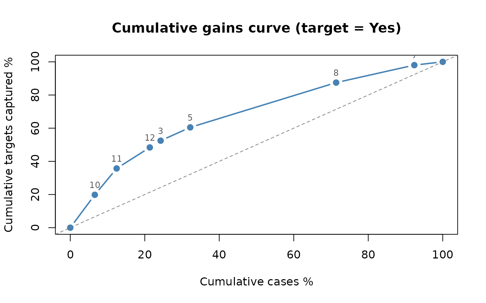
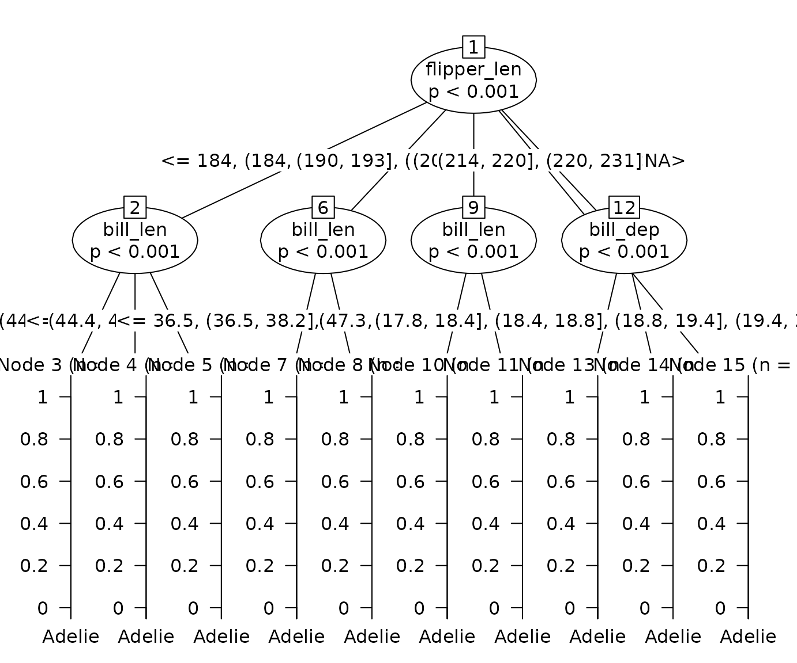

# Introduction to chaidr

chaidr implements the CHAID (Chi-squared Automatic Interaction
Detection) and Exhaustive CHAID decision tree algorithms in base R,
following the IBM SPSS Statistics Algorithms specification. Unlike
binary trees such as CART, CHAID produces **multi-way splits** driven by
hypothesis tests: categories of each predictor are merged while they are
statistically similar, and the node is split by the predictor with the
smallest Bonferroni-adjusted p value.

This vignette is a compact tour of the package. A much more detailed
tutorial (algorithm internals, Exhaustive CHAID trade-offs, weights,
misclassification costs, ordinal responses, and every visualization
backend) is available in Japanese in the companion vignette
[`vignette("chaidr-ja")`](https://morimotoosamu.github.io/chaidr/articles/chaidr-ja.md).

## Quick start

The `penguins` data set (bundled with R \>= 4.5) mixes continuous
predictors with missing values, both of which CHAID handles natively.

``` r

library(chaidr)

data(penguins)
fit <- chaid(species ~ ., data = penguins,
             control = chaid_control(min_parent = 30, min_child = 10))
print(fit)
#> CHAID decision tree (method = "chaid")
#> Response: species (categorical) 
#> Valid cases: 344 (data: 344 rows) 
#> 
#> [1] root: Adelie (44.2%), n=344 | split: flipper_len (adj.p=2.48e-63, chi2=328.5, B=714)
#>   [2] flipper_len in {<= 190}: Adelie (84.8%), n=99 | split: bill_len (adj.p=2.92e-16, chi2=78.21, B=28)
#>     [3] bill_len in {<= 40.1}: Adelie (100.0%), n=70 *
#>     [4] bill_len in {(40.1, 41.8]}: Adelie (92.3%), n=13 *
#>     [5] bill_len in {(41.8, 47.3] | > 49.3}: Chinstrap (87.5%), n=16 *
#>   [6] flipper_len in {(190, 196]}: Adelie (67.2%), n=67 | split: bill_len (adj.p=1.66e-13, chi2=58.69, B=9)
#>     [7] bill_len in {<= 44.4}: Adelie (100.0%), n=43 *
#>     [8] bill_len in {> 44.4}: Chinstrap (91.7%), n=24 *
#>   [9] flipper_len in {(196, 202]}: Chinstrap (52.6%), n=38 | split: bill_len (adj.p=2.31e-07, chi2=30.78, B=8)
#>     [10] bill_len in {<= 45.9}: Adelie (90.0%), n=20 *
#>     [11] bill_len in {> 47.3}: Chinstrap (100.0%), n=18 *
#>   [12] flipper_len in {(202, 214] | <NA>}: Gentoo (73.8%), n=61 | split: bill_dep (adj.p=9.69e-12, chi2=56.14, B=15)
#>     [13] bill_dep in {<= 16.7}: Gentoo (100.0%), n=44 *
#>     [14] bill_dep in {> 17.8 | <NA>}: Chinstrap (64.7%), n=17 *
#>   [15] flipper_len in {> 214}: Gentoo (100.0%), n=79 *
```

Continuous predictors such as `flipper_len` are discretized into up to
10 quantile bins before growing; statistically similar bins are then
merged back, producing multi-way splits. Groups containing `<NA>` show
where missing values were merged as a *floating* category. Terminal
nodes are marked with `*`.

``` r

plot(fit, main = "CHAID: penguins (species)")
```



Prediction uses the standard S3 interface:

``` r

pred <- predict(fit, penguins)          # class labels (factor)
mean(pred == penguins$species)          # training accuracy
#> [1] 0.9622093

round(predict(fit, head(penguins, 3), type = "prob"), 3)  # probabilities
#>      Adelie Chinstrap Gentoo
#> [1,]      1         0      0
#> [2,]      1         0      0
#> [3,]      1         0      0
predict(fit, head(penguins, 3), type = "node")            # terminal node ids
#> [1] 3 3 7
```

## The algorithm in brief

At each node CHAID repeats three phases:

1.  **Merge** – for every predictor, iteratively merge the pair of
    (allowable) categories with the least significant difference in the
    response, until all remaining pairs are significant (`alpha_merge`).
    Ordinal predictors may merge adjacent categories only; nominal
    predictors may merge any pair.
2.  **Split** – compute a Bonferroni-adjusted p value for each merged
    predictor and split by the best one if adjusted p \<= `alpha_split`.
3.  **Stop** – otherwise (or when depth/size limits are reached) the
    node becomes terminal.

The significance test is selected by the response type:

| Response           | Test                                            |
|--------------------|-------------------------------------------------|
| `factor` (nominal) | Pearson chi-squared (or likelihood ratio G²)    |
| `ordered`          | Goodman row-effects model (likelihood ratio H²) |
| `numeric`          | One-way ANOVA F                                 |

The main knobs of
[`chaid_control()`](https://morimotoosamu.github.io/chaidr/reference/chaid_control.md)
(defaults match the SPSS UI):

| Parameter     | Default | Meaning                                        |
|---------------|---------|------------------------------------------------|
| `alpha_merge` | 0.05    | keep merging while pairwise p exceeds this     |
| `alpha_split` | 0.05    | split when adjusted p is at or below this      |
| `max_depth`   | 3       | maximum tree depth                             |
| `min_parent`  | 100     | minimum cases to attempt a split               |
| `min_child`   | 50      | minimum cases per child node                   |
| `n_bins`      | 10      | target quantile bins for continuous predictors |

## Exhaustive CHAID

`method = "exhaustive"` keeps merging each predictor all the way down to
two categories and then picks the most significant configuration from
the whole merge history, avoiding the local optima of the standard
greedy merge. With the Titanic data it discovers additional structure
below a coarser first split:

``` r

tit <- as.data.frame(Titanic)
fit_std <- chaid(Survived ~ Class + Sex + Age, data = tit, freq = tit$Freq)
fit_ex  <- chaid(Survived ~ Class + Sex + Age, data = tit, freq = tit$Freq,
                 method = "exhaustive")
print(fit_ex)
#> CHAID decision tree (method = "exhaustive")
#> Response: Survived (categorical) 
#> Valid cases: 2201 (data: 24 rows, dropped: 8 rows) 
#> 
#> [1] root: No (67.7%), n=2201 | split: Sex (adj.p=6.91e-101, chi2=456.9, B=3)
#>   [2] Sex in {Male}: No (78.8%), n=1731 | split: Age (adj.p=4.55e-06, chi2=23.12, B=3)
#>     [3] Age in {Child}: No (54.7%), n=64 *
#>     [4] Age in {Adult}: No (79.7%), n=1667 | split: Class (adj.p=8.53e-07, chi2=37.99, B=30)
#>       [5] Class in {1st}: No (67.4%), n=175 *
#>       [6] Class in {2nd}: No (91.7%), n=168 *
#>       [7] Class in {3rd}: No (83.8%), n=462 *
#>       [8] Class in {Crew}: No (77.7%), n=862 *
#>   [9] Sex in {Female}: Yes (73.2%), n=470 | split: Class (adj.p=4.44e-28, chi2=127.4, B=30)
#>     [10] Class in {1st, 2nd, Crew}: Yes (92.7%), n=274 | split: Class (adj.p=0.0263, chi2=9.384, B=12)
#>       [11] Class in {1st}: Yes (97.2%), n=145 *
#>       [12] Class in {2nd, Crew}: Yes (87.6%), n=129 *
#>     [13] Class in {3rd}: No (54.1%), n=196 *
```

Note the `freq` argument: frequency weights make the fit on aggregated
data identical to the fit on the expanded case-level data.

The two methods redistribute the Bonferroni penalty differently, which
matters when nominal predictors with many levels are present – see the
Japanese vignette for benchmarks, a simulation of the false-positive
bias, and practical guidance on choosing between them.

## Reporting

Terminal-node summaries, decision rules (as text, SQL, or R
expressions), and a p-value-based predictor importance:

``` r

tb <- chaid_table(fit, target = "Gentoo")
tb[, setdiff(names(tb), "rule")]
#>    node depth   n pct_n prediction p_Adelie p_Chinstrap p_Gentoo response_rate
#> 1     1     0 344 100.0     Adelie   0.4419      0.1977   0.3605        0.3605
#> 2     3     2  70  20.3     Adelie   1.0000      0.0000   0.0000        0.0000
#> 3     4     2  13   3.8     Adelie   0.9231      0.0769   0.0000        0.0000
#> 4     5     2  16   4.7  Chinstrap   0.1250      0.8750   0.0000        0.0000
#> 5     7     2  43  12.5     Adelie   1.0000      0.0000   0.0000        0.0000
#> 6     8     2  24   7.0  Chinstrap   0.0833      0.9167   0.0000        0.0000
#> 7    10     2  20   5.8     Adelie   0.9000      0.1000   0.0000        0.0000
#> 8    11     2  18   5.2  Chinstrap   0.0000      1.0000   0.0000        0.0000
#> 9    13     2  44  12.8     Gentoo   0.0000      0.0000   1.0000        1.0000
#> 10   14     2  17   4.9  Chinstrap   0.2941      0.6471   0.0588        0.0588
#> 11   15     1  79  23.0     Gentoo   0.0000      0.0000   1.0000        1.0000
#>    index
#> 1  100.0
#> 2    0.0
#> 3    0.0
#> 4    0.0
#> 5    0.0
#> 6    0.0
#> 7    0.0
#> 8    0.0
#> 9  277.4
#> 10  16.3
#> 11 277.4

head(chaid_rules(fit, format = "sql"), 3)
#>   node
#> 1    3
#> 2    4
#> 3    5
#>                                                                                                                           rule
#> 1                                                                        bill_len <= 40.100000000000001 AND flipper_len <= 190
#> 2                                    (bill_len > 40.100000000000001 AND bill_len <= 41.799999999999997) AND flipper_len <= 190
#> 3 ((bill_len > 41.799999999999997 AND bill_len <= 47.299999999999997) OR bill_len > 49.299999999999997) AND flipper_len <= 190

chaid_importance(fit)
#>      variable n_splits    min_p_adj importance importance_pct
#> 3 flipper_len        1 2.484038e-63  62.604842           86.6
#> 1    bill_len        3 2.915163e-16   7.692892           10.6
#> 2    bill_dep        1 9.690029e-12   1.953006            2.7
```

Gains and lift analysis (which nodes capture the target class most
efficiently), and validation of a fitted tree on holdout data:

``` r

g <- chaid_gains(fit_std, target = "Yes")
print(g)
#> CHAID gains table (target = Yes) 
#> Overall response rate: 0.323 
#> 
#>  node   n pct_n resp pct_resp   rate index cum_pct_n cum_pct_resp cum_lift
#>    10 145  6.59  141    19.83 0.9724 301.0      6.59        19.83    3.009
#>    11 129  5.86  113    15.89 0.8760 271.2     12.45        35.72    2.869
#>    12 196  8.91   90    12.66 0.4592 142.1     21.35        48.38    2.266
#>     3  64  2.91   29     4.08 0.4531 140.3     24.26        52.46    2.162
#>     5 175  7.95   57     8.02 0.3257 100.8     32.21        60.48    1.878
#>     8 862 39.16  192    27.00 0.2227  69.0     71.38        87.48    1.226
#>     7 462 20.99   75    10.55 0.1623  50.3     92.37        98.03    1.061
#>     6 168  7.63   14     1.97 0.0833  25.8    100.00       100.00    1.000
plot(g)
```



``` r

set.seed(9)
idx <- sample(nrow(penguins), 244)
fit_tr <- chaid(species ~ ., data = penguins[idx, ],
                control = chaid_control(min_parent = 30, min_child = 10))
chaid_validate(fit_tr, penguins[-idx, ])
#> CHAID stability assessment (validation n = 100 )
#> Validation accuracy: 0.83 
#> (rate = share of the predicted class, or the mean for continuous responses.
#>  Nodes with a large |diff_rate| do not replicate on the validation data.)
#> 
#>  node prediction train_pct_n test_pct_n train_rate test_rate diff_rate
#>     2     Adelie       28.28         30     0.8841    0.7667   -0.1174
#>     4     Adelie       18.03         13     1.0000    1.0000    0.0000
#>     5  Chinstrap        4.10          6     0.7000    0.8333    0.1333
#>     6  Chinstrap        8.61          7     1.0000    1.0000    0.0000
#>     7     Gentoo        8.20          8     0.5500    0.3750   -0.1750
#>     8     Gentoo       10.25         10     0.9200    0.7000   -0.2200
#>     9     Gentoo       22.54         26     1.0000    0.9615   -0.0385
```

## Visualization

The built-in [`plot()`](https://rdrr.io/r/graphics/plot.default.html)
method (shown above) needs no extra packages. Three optional backends
are available:

``` r

chaid_graphviz(fit)              # 'Graphviz' via DiagrammeR (publication quality)
chaid_dot(fit, file = "tree.gv") # raw DOT export for the dot CLI
chaid_plotly(fit)                # interactive htmlwidget with hover details
```

A fitted tree can also be converted to a
[`partykit::party`](https://rdrr.io/pkg/partykit/man/party.html) object,
which opens up the partykit and ggparty plotting ecosystems:

``` r

pt <- chaid_as_party(fit, penguins)   # pass the data used for fitting
plot(pt)
```



## Further reading

- [`vignette("chaidr-ja")`](https://morimotoosamu.github.io/chaidr/articles/chaidr-ja.md)
  – detailed tutorial (in Japanese): algorithm internals, standard
  vs. Exhaustive CHAID, weights, missing-value handling, multiplicity
  adjustment across predictors, comparison with CART, misclassification
  costs, ordinal responses, and all visualization backends.

## References

- Kass, G. V. (1980). An exploratory technique for investigating large
  quantities of categorical data. *Applied Statistics*, 29(2), 119–127.
- Biggs, D., de Ville, B., & Suen, E. (1991). A method of choosing
  multiway partitions for classification and decision trees. *Journal of
  Applied Statistics*, 18(1), 49–62.
- IBM Corp. *IBM SPSS Statistics Algorithms* – “CHAID and Exhaustive
  CHAID Algorithms”.
